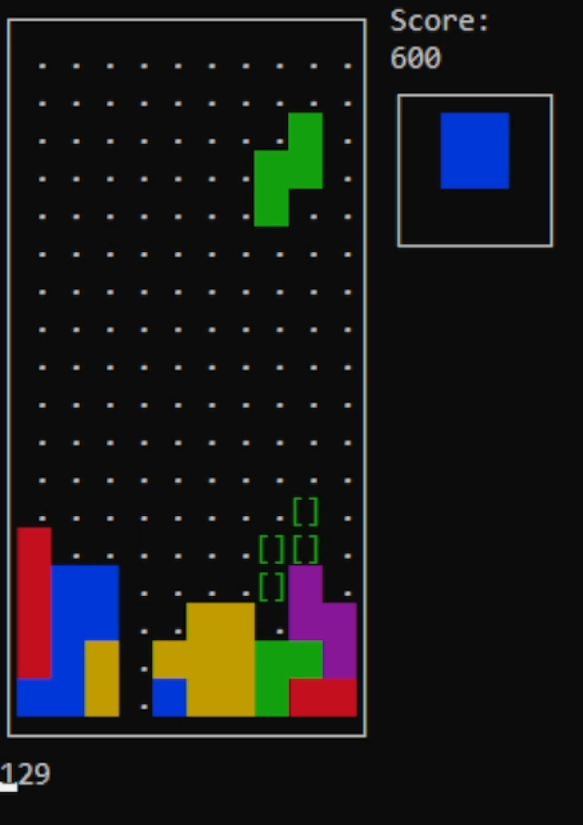

# CursesTetris
## Controls
#### Arrow keys supported
A = ← \
D = → \
S = &nbsp;↓  \
SPACE = Hard Drop ↓ \
E = ↷ \
Q = ↶  \
&nbsp;↑ = ↷ \
ESC = Exit \

## Build Instructions
for ubuntu/debian like distros
```bash
sudo apt-get install libncursesw5-dev
```
for windows use mingw

```bash
make
or
gcc main.c -o EXECUTABLE_NAME -lncursesw -DNCURSESW_STATIC
```
or use cmake

